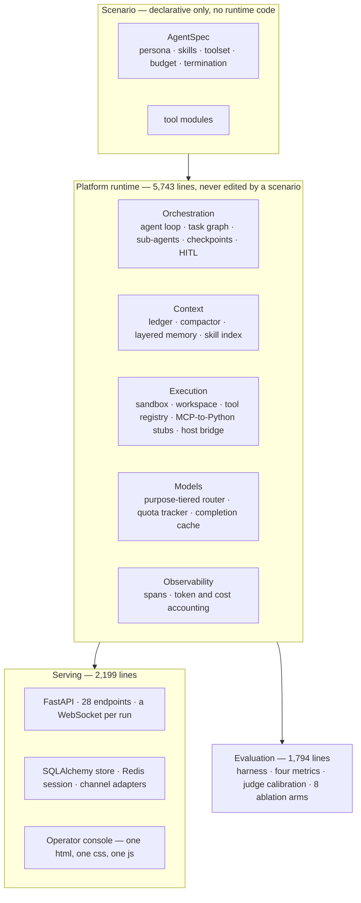
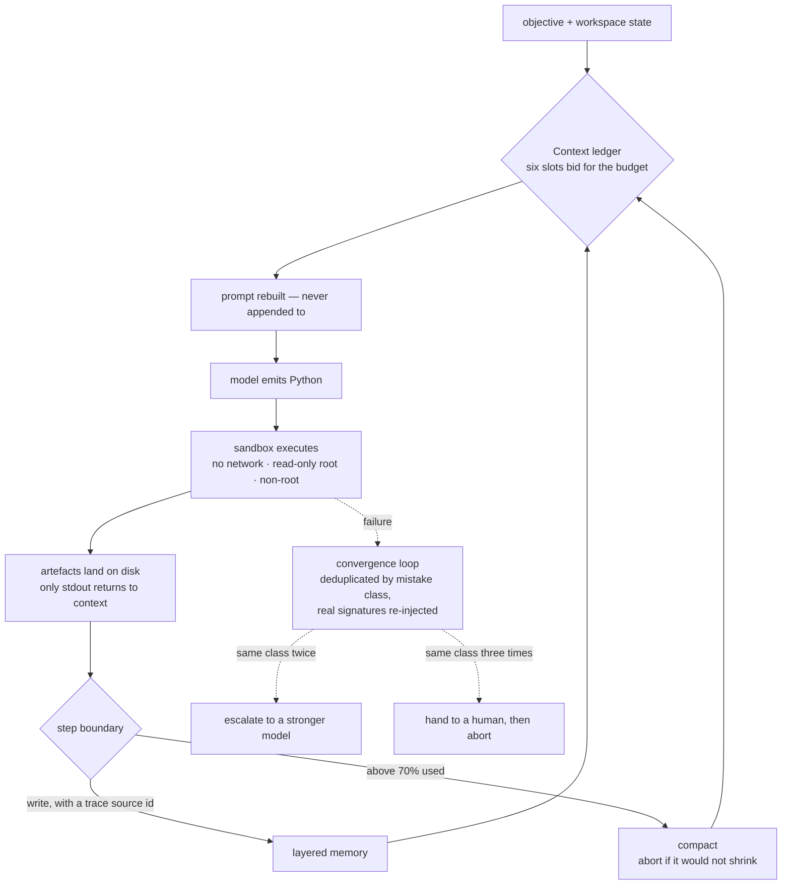
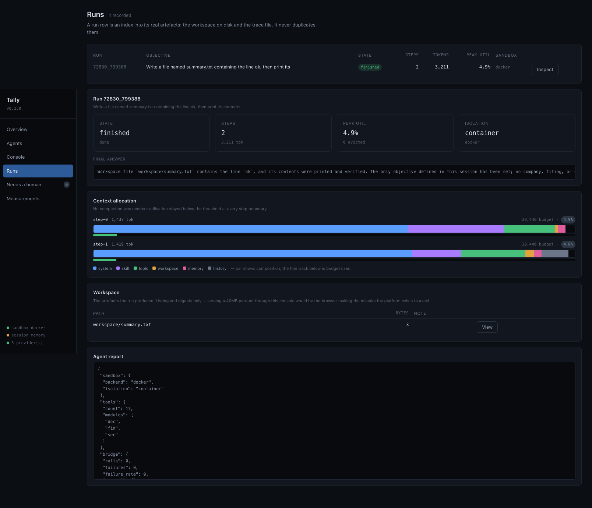
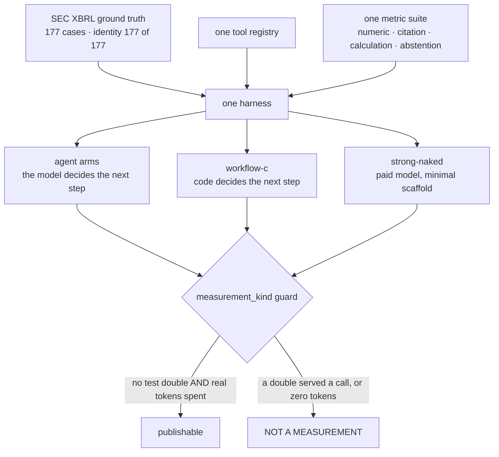
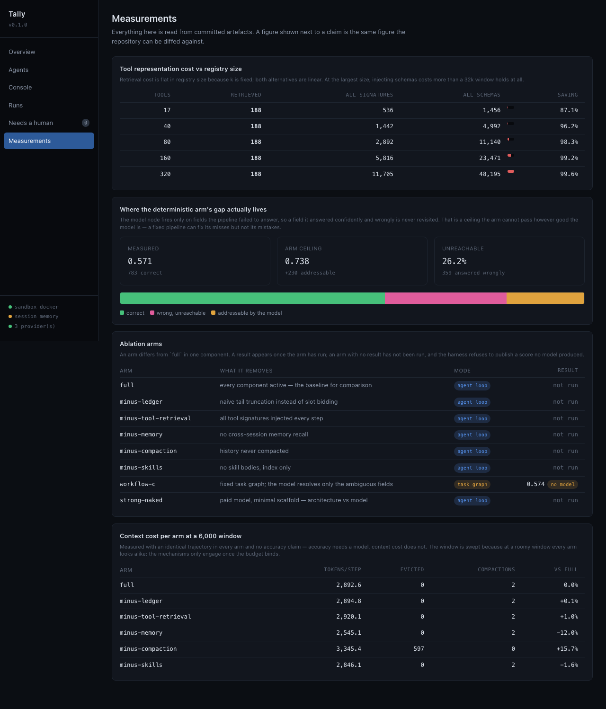
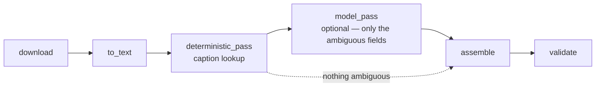
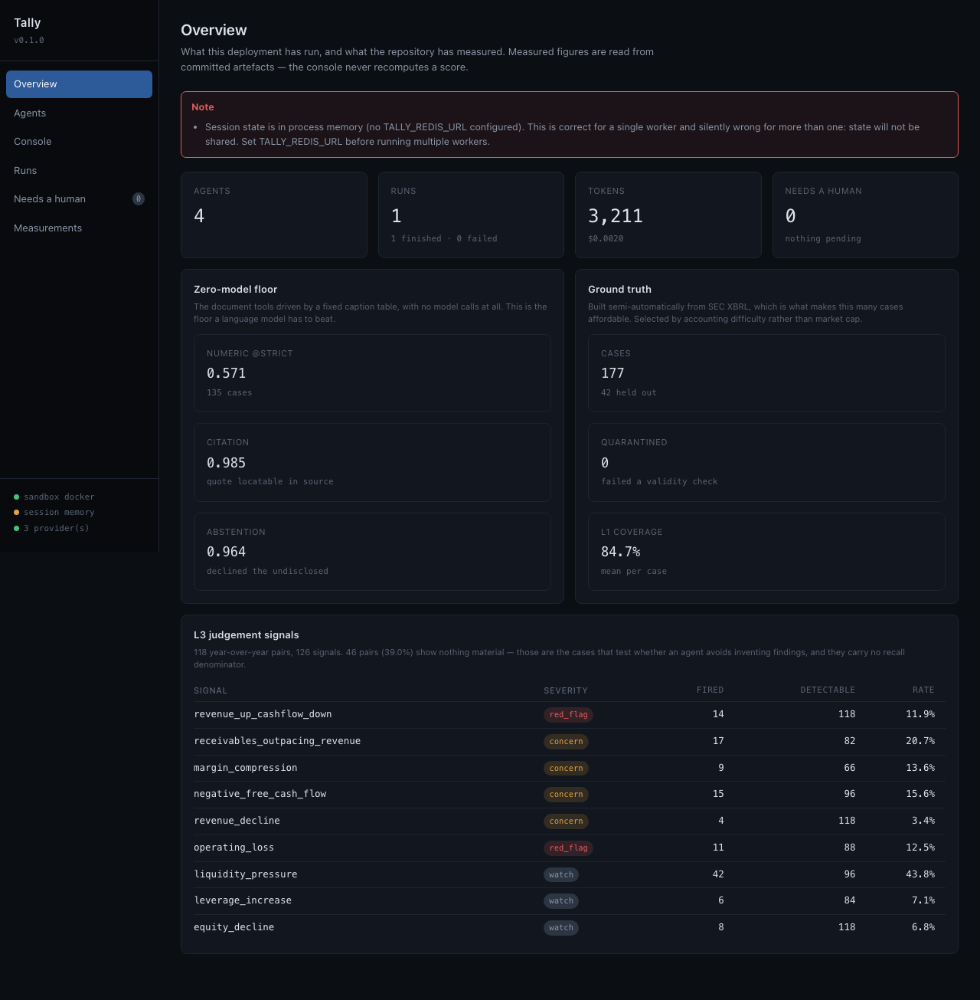

<h1 align="center">Tally</h1>

<p align="center">
  <b>A multi-agent platform whose only action is writing Python in a sandbox,<br>
  whose context is allocated by an auditable token budget,<br>
  and whose every claim is scored against XBRL ground truth.</b>
</p>

<p align="center">
  
  
  
  
  
  
</p>

---

> **The question this repository exists to answer, with data:**
> *how much of an agent's quality comes from its architecture rather than its model?*
>
> So it runs on free-tier models **by design**. If a strong paid model produced the
> numbers, the question would be unanswerable.

### The 30-second version

| | Measured | Needs a model? |
|---|---|---|
| Ground-truth corpus built from SEC XBRL | **177 cases**, 0 quarantined, balance-sheet identity **177/177**, error **0.0** | no |
| Zero-model floor over 135 cases | numeric **0.571** · citation **0.985** · abstention **0.964** | no |
| One 10-K, whole, in a prompt | **61,206 tokens** — a single filing overflows a 32k window | no |
| Tool signatures a step actually pays for | **188 tokens, flat in registry size** | no |
| Same tools as JSON schemas at 320 tools | **48,195 tokens** — more than a 32k window holds | no |
| Removing compaction at a 6k window | **+15.7% tokens/step** *and* **597 tokens evicted** | no |
| Structural ceiling of the fixed-pipeline arm | **0.738**, with **26.2 points unreachable** | no |
| Cost of adding a new scenario | **288 lines**, **0 runtime changes** | no |
| Container isolation | **10 properties** checked against a live daemon | no |
| Test suite | **284 tests** (273 offline, 11 container-gated) | no |

**Every number above is model-independent** — which is deliberate. They do not expire
when the model landscape moves, and none of them can be flattered by picking a better model.
What *is* still unmeasured says so, [in its own section](#not-yet-measured).

---

## 中文速览

**一句话**:一个多 Agent 平台,Agent 的唯一动作是「在沙箱里写 Python」;它的上下文由一套
可审计的 token 预算机制分配;它说出的每一个数字都要对着 SEC XBRL 真值集打分。

**为什么值得看**:多数 Agent 项目描述的是一条流水线,这个项目描述的是一次**测量** ——
核心命题是「Agent 的能力有多少来自架构,多少来自模型」。为使该命题可回答,平台
**刻意运行在免费/低价模型上**:如果用强付费模型跑出好成绩,架构贡献与模型贡献就无法分离。

| 你可能会问 | 这里的答案 |
|---|---|
| 上下文工程具体做了什么 | 六槽位**竞价式**预算:硬下限 + 弹性系数 + 目标份额,每步**重建** prompt 而非追加,余量流向最不弹性的槽位 —— 保证检索记忆永不挤出操作契约 |
| 为什么不用 Function Calling | 工具编译成可 `import` 的 Python 模块。320 个工具时全量 schema 要 **48,195 tokens**(超过整个 32k 窗口),检索门控恒定 **188 tokens/步** |
| 分层记忆怎么交代 | 写入时机、入选依据、**冲突解决(默认置信度优先而非后写胜)**、裁剪顺序、召回准确率 —— 五问全部由代码回答,记忆层有独立的 precision@k / recall@k |
| 评测凭什么可信 | XBRL 半自动真值集(**恒等式 177/177 误差 0.0**)+ 四类互补指标 + judge 报告自身 **Cohen's κ**(低于 0.6 的维度从 headline 撤出) |
| Agent 比固化 workflow 强在哪 | 量化了:固化管道有 **0.738 的硬天花板**,**26.2 个百分点结构不可达** —— 模型节点只在「未答出」时触发,答错的字段永不复查。**能修补遗漏,修不了错误** |
| 成本怎么控 | 按「调用目的」而非模型名路由、配额滑窗主动避让、限流即降级不重试、请求指纹磁盘缓存;付费 provider 默认不可达 |
| 最想让人看到的一条 | Harness **拒绝发布不是测量的数字**:测试替身拿到 1.000 满分仍被拒;无凭据运行的一屏零被判为无效 |

**目录**:[架构](#architecture-at-a-glance) · [一个 step](#how-one-step-works) ·
[上下文预算](#the-context-ledger) · [评测](#why-these-numbers-are-evidence) ·
[实测数据](#what-is-measured) · [自主性对照](#agent-versus-fixed-workflow) ·
[控制台](#the-console) · [尚未测量](#not-yet-measured) ·
[踩过的坑](#notes-from-building-it)

---

## Try it

```bash
uv venv --python 3.13 && uv pip install -e ".[dev]"
cp .env.example .env          # set TALLY_SEC_USER_AGENT at minimum
python -m pytest -q           # 273 offline; 11 more if a sandbox image exists

tally serve        # the console and the API on localhost:8000
tally doctor       # what is configured and reachable
tally baseline     # the zero-model floor — needs no credentials at all
tally scenarios    # cost of adding a scenario
tally tools        # tool-representation token costs
tally dataset build && tally dataset stats
tally eval --arm full --level l1     # or --level l2 / l3
tally ablate --level l1
```

---

## Architecture at a glance

A scenario is **declarative only**. It contributes an `AgentSpec` and tool modules and
nothing else — no subclassing, no monkey-patching, no runtime edits. That is not a
convention; `tests/test_platform_abstraction.py` AST-checks it and runs three scenarios
end-to-end through the same `Agent` class.



Four scenarios ship, deliberately **heterogeneous** — a platform running one scenario is
an application with a plugin folder:

| Scenario | What it stresses | Bridged tools | Lines | Runtime changes |
|---|---|---|---|---|
| `dd_finance` (deep) | extreme context pressure, numeric precision | 2 | 2,404 | **0** |
| `bi_analyst` | schema-as-context, execution safety on generated SQL | **0** | 240 | **0** |
| `deep_research` | sub-agent isolation, provenance as a tool invariant | 2 | 306 | **0** |
| `code_engineer` | sandbox filesystem, an external test oracle | **0** | 320 | **0** |

Light scenarios: **mean 288 lines, range 240–320, zero runtime changes.** Two need no host
bridge at all, which shows the bridge is an option the platform offers rather than a
dependency it imposes.

---

## How one step works



Tools are not JSON schemas but modules the agent imports:

```python
from tools import sec, doc, fin
meta = sec.download_filing(ticker="AAPL", fiscal_year=2024)   # host-side, audited
info = doc.to_text(meta["path"])                              # in-sandbox
hit  = doc.find_number(info["path"], "Total net sales")["candidates"][0]
print(hit["values"][0], hit["page_estimate"], hit["scale"])   # only this returns
```

**Only what it prints comes back.** Everything else stays in the workspace. One decision
buys three properties: the context stays small, step 40 can read what step 3 wrote, and
resuming a crashed run is a re-read rather than a replay — the workspace *is* the checkpoint.

The sandbox runs with no network. Tools that need egress execute host-side and are reached
through a file-based RPC in the one directory both sides share, so the host broker is a
single chokepoint where every outbound call is authorised and logged to `.rpc/audit.jsonl`.

Two backends, and a result **always records which one produced it**. The container
backend's properties are verified rather than asserted — `tests/test_docker_sandbox.py`
checks all ten against a live daemon and skips cleanly when one is absent:

| Property | How it is verified |
|---|---|
| Runs as non-root | uid 1000 |
| Network unreachable | the kernel refuses the connection — not a static check |
| Root filesystem read-only | a write to `/etc` raises |
| Workspace writable, visible on host | round-trips |
| Packages cannot be installed | `pip install` returns non-zero |
| Memory cap | a 3 GB allocation is killed (exit 137) |
| Wall clock | an infinite loop is killed (exit 124) |
| Host bridge from a network-free container | the tool call reaches the host |
| Traceback line numbers | match the agent's own code exactly |
| Unshared mount path | detected, with an actionable reason |

The subprocess fallback is *honestly weaker* — it shares the host kernel and filesystem
namespace — and labels itself `process-rlimits-only`, so any result produced under it
carries that fact.

---

## The context ledger

Every prompt is rebuilt from scratch, never appended to, and each slot bids for a share of
`window − max_output − safety`:

| Slot | Hard floor | Elasticity | Eviction strategy |
|---|---|---|---|
| system / persona | 256 | 0.00 | never |
| active skills | 0 | 0.35 | drop bodies, keep the index |
| tool signatures | 200 | 0.55 | retrieval-filtered |
| workspace state | 120 | 0.45 | tree + digests, never file bodies |
| long-term memory | 0 | 0.90 | relevance × decay × confidence |
| session history | 400 | 0.75 | tail verbatim, middle summarised |

Hard floors are reserved first; surplus flows to the **least elastic** claimant. Together
those two rules are why retrieved memory can never squeeze out the operating contract —
the failure mode that makes "layered memory" claims untrustworthy. There is a test named
after it.

Every construction emits a `LedgerRecord` naming each slot's allowance, usage and what it
evicted, so any prompt can be explained after the fact:

```
[STTTTTTTTTTTTTTTTTTMMMMMMMMMHHHHHHHHHHHHHHHHHHHHHHHHHHHHH...] 6600/6800 tok
  S=system:162  T=tools:2088  M=memory:1056  H=history:3283
```

And the console draws the same record live, one bar per step:



Compaction fires only at **step boundaries** above 70% utilisation — compressing
mid-reasoning breaks the chain the model is in the middle of — and it aborts if the summary
would not actually shrink what it replaces.

### Memory that can be interrogated

Five questions any reviewer asks about "layered memory", answered in code rather than prose:

1. **When is it written?** Only through `MemoryStore.write`, at step boundaries, with an
   explicit `source` span id. There is no remember-everything path.
2. **Who decides what enters the context?** `recall` scores
   `relevance × decay × confidence` and the ledger's memory slot allocates a budget. Every
   recall can be explained: `rel=0.83 decay=0.97 conf=0.95 → 0.76`.
3. **What happens on conflict?** An explicit `ConflictPolicy`, defaulting to
   **highest-confidence, not last-write-wins** — because under last-write-wins a single
   low-confidence extraction destroys a verified fact. The loser is kept on disk marked
   superseded.
4. **What is trimmed first?** Memory: floor 0, highest elasticity of any slot.
5. **How accurate is recall?** `recall_metrics` gives the memory layer its own
   precision@k / recall@k against a labelled probe set, so it is not hiding inside an
   end-to-end score.

### The convergence loop

A small model writing sandbox code fails constantly, so the loop that turns a traceback
back into a corrected attempt is most of whether the agent works.

Feedback is structured, not a raw traceback: exception class, the offending line quoted
from the agent's own code, a hint specific to the failure kind, and **the misused module's
real signatures re-injected**. Repetition is detected by *mistake class* —
`name 'df' is not defined` and `name 'tbl' is not defined` are one misconception repeated,
not two errors — and escalation is bounded: same class twice → a stronger model, three
times → a human, then abort.

---

## Why these numbers are evidence

The arms differ in exactly one thing — **who decides the next step**. Corpus, tool modules,
metrics and harness are shared, which is what makes the autonomy comparison a measurement
rather than an argument.



Ground truth comes from SEC XBRL, which the agent is **never given**.
`assert_no_truth_leak` fails the build if any tool could serve company facts, and a test
asserts it — a tool that exposed the answer key would turn the task from reading a filing
into calling the oracle.

Four metrics, each for a failure the others cannot see:

| Metric | Level | Catches |
|---|---|---|
| Numeric accuracy (3 tolerance bands) | L1, L2 | wrong values; bands separate rounding from nonsense |
| **Citation verifiability** | L1 | a correct number that was guessed — the quote is not in the source |
| **Calculation consistency** | L2 | right inputs with broken arithmetic, *and* clean arithmetic over invented inputs |
| **Abstention accuracy** | L1, L2 | inventing a figure the filer never disclosed |
| **Signal recall / precision** | L3 | missing what the figures show, and asserting what they do not |

For the judgement layer the LLM judge grades a rubric on top of an objective backbone, and
its **Cohen's κ against human labels is reported per dimension**, with dimensions below
κ=0.6 withheld from the headline and flagged for human spot-checks. A judge that does not
agree with humans is not evidence about the agent. Both plain and quadratic-weighted κ are
reported, since a judge scoring 4 where a human scored 5 is not the same error as scoring 1.

### The guard that refuses flattering numbers

A run is a measurement only if no test double served any call **and** real model tokens
were consumed:

```
$ tally eval --arm full --level l1
no usable model provider — every case would fail on NoProviderAvailable
and the report would be a table of zeros.
Configure at least one free-tier key in .env, or run ollama serve …
Run tally baseline for the zero-model floor, which needs no provider at all.
```

Both halves exist because both failures happened here. The scripted-provider path scores a
perfect **1.000** on a case and is still refused (`tests/test_harness_end_to_end.py`), and
the *first* real invocation of `tally eval` with no credentials produced a full report of
zeros marked `valid_measurement: True` — indistinguishable from a genuine score of zero.
There is a test named after that one too.

Four kinds are distinguished, because "zero tokens" means two opposite things:

| Kind | Meaning | Publishable |
|---|---|---|
| `model` | real tokens consumed | yes |
| `deterministic` | every case completed, no inference required | yes, **labelled as such** |
| `plumbing` | a test double served a call | no |
| `none` | zero tokens *and* cases errored — an unconfigured run | no |

---

## What is measured

Numbers below are real output from this repository, not targets. Anything not yet measured
says so. The console reads the same committed artefacts and never recomputes a score:



### Ground-truth corpus — built, 177 cases

Constructed semi-automatically from SEC XBRL company facts, which is what makes 177 cases
affordable where hand-labelling would cap at a few dozen.

| | |
|---|---|
| Cases | **177** (135 primary + 42 held out) |
| Companies × years | 60 × 3 |
| Quarantined | 0 |
| Build errors | 0 |
| Mean L1 field coverage | 84.7% |
| Balance-sheet identity | **177/177 pass, relative error 0.0** |

Selection is by **accounting difficulty**, not market cap: 12 bank cases and 12 insurance
cases have no current/non-current split, 78 cases have no cost-of-revenue line at all.
Those absences are the entire test of *abstention* — a model that invents a current ratio
for a bank is hallucinating, and a corpus of large-cap tech filers would never reveal it.

### Zero-model floor — measured over all 135 primary cases

The document tools driven by a fixed caption table, with **no model calls at all**. This is
the floor a language model has to beat, and the cheapest regression test for the extraction
stack.

| Metric | Rate | |
|---|---|---|
| Numeric accuracy @strict (±0.5%) | **0.571** | 783 / 1372 |
| Citation verifiability | **0.985** | 1254 / 1273 |
| Abstention accuracy | **0.964** | 81 / 84 |

The shape matters more than the headline. Citations and abstentions are near perfect
because the tools only report what they actually located — so the **43-point gap in numeric
accuracy is the space a model has to earn**. And the metric suite discriminates by
difficulty as intended:

| Hardest | | Easiest | |
|---|---|---|---|
| utilities | 0.383 | semis | 0.917 |
| insurance | 0.386 | consumer | 0.789 |
| banks | 0.460 | staples | 0.708 |

### Context cost — measured

| | Tokens |
|---|---|
| One 10-K, whole, in the prompt | **61,206** |
| Tool signatures a step actually receives (5 of 17, retrieval-filtered) | **188** |
| All 17 tool signatures, no retrieval | 536 |
| All 17 tools as MCP JSON schemas | 1,456 |
| Tool stub sources (on disk, never in a prompt) | 6,739 |

A single filing exceeds a 32k window by itself, which is why the workspace holds documents
and the prompt holds digests.

**Retrieval cost is flat in registry size; both alternatives are linear.** At 17 tools the
saving is real but modest, and reporting only that would understate the mechanism — an
agent wired to a few MCP servers has hundreds of tools.
`scripts/tool_retrieval_scaling.py` measures the same quantity as the registry grows (sizes
above 17 are synthetic tools shaped like real ones):

| Tools | Retrieved (k=8) | All signatures | All schemas | Saving vs schemas |
|---|---|---|---|---|
| 17 | **188** | 536 | 1,456 | 87.1% |
| 40 | **188** | 1,442 | 4,992 | 96.2% |
| 80 | **188** | 2,892 | 11,140 | 98.3% |
| 160 | **188** | 5,816 | 23,471 | 99.2% |
| 320 | **188** | 11,705 | **48,195** | 99.6% |

At 320 tools, publishing schemas costs **48,195 tokens — more than a 32k window holds at
all.** That is the argument for compiling tools into an importable package rather than
injecting their schemas.

### Arm context cost — measured, and honestly bounded

An arm differs from `full` in two separable ways: how much context it spends and how
accurate it is. The second needs a model; the first does not.
`scripts/arm_context_cost.py` drives an identical 16-step trajectory through every arm
across a window sweep. At a 6,000-token window, where the budget actually binds:

| Arm | Mean tokens/step | Evicted | Compactions | vs full |
|---|---|---|---|---|
| `full` | 2,891 | 0 | 2 | — |
| `minus-compaction` | 3,345 | **597** | 0 | **+15.7%** |
| `minus-tool-retrieval` | 2,920 | 0 | 2 | +1.0% |
| `minus-memory` | 2,545 | 0 | 2 | −12.0% |

**Compaction prevents eviction**: without it the run spends 15.7% more context per step
*and* still loses 597 tokens to eviction. The effect disappears above a 12k window — the
mechanism is inert when the budget is roomy, and the sweep is there to show where the
crossover is.

> **What this measurement cannot show, stated plainly.** `minus-ledger` differs from `full`
> by 0.1% in every configuration tested. The ledger's guarantee is a *worst-case* property —
> hard floors and pinning stop retrieved memory from evicting the operating contract — and it
> binds only when the requested content genuinely exceeds the budget, which this trajectory
> never quite reaches. It is demonstrated by a targeted test
> (`test_retrieved_memory_cannot_evict_the_system_prompt`), not by a token saving, and
> manufacturing a scenario to produce a flattering number here would be dishonest.

### L3 judgement ground truth — built, 118 year-over-year pairs

L3 is the judgement level: what do two years of figures actually show? An LLM judge alone
would be weak — it cannot separate "wrote persuasively" from "noticed the right thing", and
its own reliability has to be established before its scores mean anything.

So L3 gets an **objective backbone**. A large part of what makes a diligence finding correct
is derivable: if revenue rose while operating cash flow fell, that is a fact about the
numbers. Nine such signals are computed from consecutive years of L1 truth, each with a
materiality threshold so ordinary noise does not trigger it, and findings are scored for
**recall** (did the agent notice what is there) and **precision** (did it assert what is
not). The judge then grades only what genuinely needs judgement.

| | |
|---|---|
| Year-over-year pairs | **118** across 59 companies |
| Signals detected | 126, mean 1.07 per pair |
| **Quiet pairs (nothing material)** | **46 — 39%** |

| Signal | Severity | Fired | Detectable | Rate |
|---|---|---|---|---|
| liquidity_pressure | watch | 42 | 96 | 43.8% |
| receivables_outpacing_revenue | concern | 17 | 82 | 20.7% |
| negative_free_cash_flow | concern | 15 | 96 | 15.6% |
| revenue_up_cashflow_down | **red flag** | 14 | 118 | 11.9% |
| operating_loss | **red flag** | 11 | 88 | 12.5% |
| margin_compression | concern | 9 | 66 | 13.6% |
| equity_decline | watch | 8 | 118 | 6.8% |
| leverage_increase | watch | 6 | 84 | 7.1% |
| revenue_decline | concern | 4 | 118 | 3.4% |

The signal-dense cases are the ones that should be — PLUG (6 signals), RIVN (5), Boeing (4) —
and `detectable` varies by filer, so a bank is never penalised for failing to report a
current ratio it cannot compute.

Two design choices carry most of the weight here:

**The 39% quiet pairs are not filler.** They are the cases that test whether the agent
avoids inventing findings, and they carry no recall denominator by design — a quiet case
answered quietly has an *undefined* recall, not a recall of zero. Reading 0.00 as failure
would invert the interpretation of the best possible outcome, so `MetricResult.applicable`
says so and the pooled report counts `correctly_silent` and `fabricated_on_quiet_case`
separately.

**The prompt never names the signals.** Handing the agent the taxonomy would turn analysis
into filling in a form, and the metric would measure format compliance. There is a test
asserting the prompt contains none of the signal keys, and scoring therefore falls back to
keyword matching over prose — requiring two distinct keywords, so a passing mention of
"cash flow" is not credited as having found the divergence.

---

## Agent versus fixed workflow

"Autonomous agent" versus "workflow with LLM nodes" is usually argued abstractly. The two
are only comparable if built against the same tools and scored by the same metrics, which
is what having a platform is for. `workflow-c` is a fixed six-node task graph that shares
the corpus, tool modules, four metrics and harness with every other arm, and differs only
in **who decides the next step**:



It returns the same `CaseRunResult` as the agent runner, so the harness cannot tell the two
apart. That interchangeability is the fair-comparison guarantee.

**Run over all 135 primary cases** (no provider configured, so the caption node degraded to
abstention on every call):

| | |
|---|---|
| Numeric accuracy @strict | **0.574** |
| Abstention accuracy | **0.964** |
| Cases completed | 135 / 135, 0 errors |
| Model tokens | 0 — `measurement_kind: deterministic` |
| Field slots resolved by code | 1,216 of 1,620 (75.1%) |
| Field slots routed to the model node | 404 (24.9%) |

**And it produced the project's strongest result, with no model involved at all.** Of the
404 routed fields, 174 are ones the filer genuinely does not disclose — correct abstentions
either way — leaving **230 the model node could actually win**. That bounds the arm from
above:

| Where the gap to perfect lives | Slots | Share |
|---|---|---|
| Correct | 783 | 57.1% |
| **Resolved confidently but wrongly** | **359** | **26.2%** |
| Unresolved, routed to the model | 230 | 16.8% |

So `workflow-c` has a **hard ceiling of 0.738** — reachable only if the model resolved every
routed field perfectly — and **26.2 points of its gap are structurally unreachable**. The
model node fires only on fields the pipeline *failed* to answer, so a field it answered
confidently and wrongly is never revisited, however good the model is.

> That is the agent-versus-workflow tradeoff, quantified:
> **a fixed pipeline can fix its misses but not its mistakes.**
> An agent that can notice a bad answer and re-check has no such ceiling — which is the
> thing worth measuring once the model arms run, and the reason the comparison needed both
> implemented against the same tools rather than argued about.

---

## Zero-cost model routing

Purpose is the routing key, not a model name, so the cost policy lives in one place:

| Purpose | Routed to |
|---|---|
| plan / decide / code / reflect | free cloud tiers (Gemini Flash, GLM-Flash, Groq, Cerebras), then local as last resort |
| extract / classify / rewrite | local Qwen3-8B via Ollama, first |
| judge | cloud only — **a model must not grade its own work** |

The local tier is *last* on the reasoning purposes and *first* on extraction, which encodes
that an 8B model is a workable fallback planner and a perfectly good extractor. It is on
those lists at all because a machine with no cloud credentials and a running Ollama is the
genuine zero-cost configuration, and a policy that omitted it there would fail every case
with `NoProviderAvailable` rather than run slowly. Judging stays cloud-only on purpose: a
local-only setup would otherwise have the actor grade its own output, and an eval that
cannot grade independently should fail loudly instead.

High-volume, low-difficulty calls go local *specifically* so they do not burn the daily
request budget that planning needs. Beyond that: quota tracked in sliding windows with
**proactive avoidance** (a 429 discovered by hitting it costs both latency and a quota
slot), degradation rather than retry on rate limits, and a **disk cache keyed by request
fingerprint** — which is what makes seven ablation arms affordable, since the arms share
most of their prompts. Pricing resolves by **route, not by model**: the same model costs
differently on a free tier and a paid gateway.

Paid providers are unreachable unless a caller explicitly opts in; only the `strong-naked`
arm does.

---

## The console

`tally serve` puts the platform behind FastAPI and serves an operator console at `/`. It
exists for one reason: **the context-engineering work is the hardest part of this system to
explain in a sentence and the easiest to show.**



The centrepiece is the per-step allocation panel — one bar per prompt, live over a
WebSocket as each step is built, showing which slot got what and what it dropped. "Slot
bidding with hard floors" stops being a claim and becomes something you point at.

Two design notes worth stating, because both were corrected by looking at it:

**Composition and pressure are separate visual channels.** The first version sized each slot
against the whole budget. That is arithmetically right and useless — at 4% utilisation the
entire composition collapses into a four-pixel sliver, so the one thing the chart exists to
show is invisible exactly when the budget is comfortable. Composition is now normalised to
what the prompt actually used, and budget pressure gets its own thin track underneath.

**No build step and no framework.** The rest of this project runs offline with no
credentials; a dashboard that needed `npm install` to render would be the one part nobody
could start. It is one HTML file, one stylesheet and one script, served by the app.

| View | What it is for |
|---|---|
| Overview | what this deployment ran, and the repository's measured figures |
| Agents | create and edit declarations; grant A2A delegation per pair |
| Console | give an agent an objective, watch the allocation and the trace live |
| Runs | inspect any past run: allocation, trace, workspace artefacts |
| Needs a human | the HITL queue — approve, deny, or send guidance |
| Measurements | the tool-cost curve, the ablation arms, the gap decomposition |

### The serving layer

```
FastAPI  28 endpoints + a WebSocket per run
         reads open, mutations behind a token, webhooks behind a platform signature
Store    SQLAlchemy: agent declarations, A2A relations, conversations, run records
         a run row points at its workspace and trace; it never copies them
Session  Redis when reachable, process memory when not, and it says which and why
Channels inbound webhooks — verification and idempotency are enforced by the route,
         so no adapter can forget them
```

Three decisions carry most of it.

**The agent loop is synchronous and the API is not.** Runs execute on a bounded thread pool
and communicate back through per-run queues; the tracer's subscription hands each span to
the event loop with `call_soon_threadsafe`. A browser closing a tab drops events rather
than failing an agent. Cancellation is cooperative and says so — a thread holding a
container cannot be killed safely, so cancel takes effect at the next step boundary and the
response tells you that instead of implying it already happened.

**A run row is an index, not a copy.** The database answers "which agents exist and what
happened"; the filesystem answers "what does this run know". Storing run state in both
would make resume a merge rather than a re-read, which is the property the whole workspace
design exists to preserve.

**Inbound webhooks are verified and deduplicated by the route, not the adapter.** Anyone who
learns the URL can otherwise make an agent run, and every channel redelivers on a slow 200 —
which an agent run always is. Doing both once, in the route, means no adapter can omit them.

### Sub-agents and A2A authorisation

A sub-agent is spawned not for parallelism but so **the parent need not hold the child's
working context**: the child gets a fresh ledger, an empty history and its own workspace
subtree; the parent recovers a digest and artefact paths and **never the child's
transcript**; files hand over through the shared workspace. Cost is attributed per agent, so
"which sub-agent burned the quota" is answerable.

`AgentStore.may_delegate` is the entire permission model, and it takes no tenant argument at
all:

```python
store.may_delegate(source_id, target_id, need_files=False) -> Denial
```

- **Absence is denial.** An unlisted pair is refused; there is no default-allow path and no
  wildcard.
- **The tenant is a column on the stored relation**, so a caller cannot authorise a
  cross-tenant delegation by asserting a tenant.
- **Grants are directional**, file transfer is a separate permission, a disabled target is
  refused, and self-delegation is refused before anything else — an agent that can delegate
  to itself recurses without bound.
- Refusals name which condition failed, and `POST /api/a2a/check` exposes the same decision
  so it can be inspected outside a run.

---

## Not yet measured

**The model arms.** No provider credentials are committed in this repository, so seven of
the eight arms in `tally ablate` — `full`, `minus-ledger`, `minus-tool-retrieval`,
`minus-memory`, `minus-compaction`, `minus-skills`, `strong-naked` — are implemented and
runnable but **unrun**. Same for the judge's κ calibration, which needs both a judge model
and a human-labelled set. The eighth, `workflow-c`, needs no credentials and did run.

**End-to-end accuracy.** What exists is contradictory and neither half is a result:
gemini-2.5-flash scored 9/12 on a single case (**n=1**), and deepseek-v4-flash hit the
14-step ceiling on all three cases of a smoke test without producing a deliverable
(**n=3, score 0**). Quoting the flattering half would be the exact thing this project argues
against, so the arms are reported as unmeasured.

**To produce them**, either path works and both cost nothing:

```bash
# A — entirely local. No account, no key. ~5GB model download.
brew install ollama && ollama serve &
ollama pull qwen3:8b
tally doctor                       # ollama should read available=yes
tally ablate --level l1 --limit 30

# B — free cloud tier. Faster and stronger; needs one signup.
#     Set any one of these in .env, then the same command:
#     TALLY_GEMINI_API_KEY / TALLY_GLM_API_KEY
#     TALLY_GROQ_API_KEY   / TALLY_CEREBRAS_API_KEY
tally ablate --level l1 --limit 30
```

Path A cannot run the `judge`, by design — see the routing table. Everything else,
including all seven agent arms, runs on the local tier.

### Delivered against the design, and what is not

The design doc is `docs/superpowers/specs/2026-09-09-agent-platform-design.md`. All 26
capabilities it specifies are implemented, all six roadmap stages are landed, and all eight
ablation arms exist. One thing it promised is **not** here:

**A-share Chinese annual reports.** Stage 5 named them as cross-language generalisation
evidence. The pieces that would need custom work are in place and verified — the retrieval
layer tokenises and ranks CJK correctly (character unigrams plus IDF, with a Chinese
stopword list), and the concept-mapping layer is source-agnostic — but no A-share corpus is
wired up. Unlike SEC, there is no official structured API, so the ground truth would need a
different acquisition path and a different validation strategy than the XBRL identity check
that underpins the current 177 cases. Half-building it would have produced a corpus I could
not vouch for, which is worse than not having one.

---

## Notes from building it

Defects found by running against real filings rather than fixtures. Each is now a named
regression test — and each is the kind of thing that only shows up when the data is real.

<details>
<summary><b>Ground-truth traps in XBRL and SEC's own API</b> — five ways to build a truth set that is confidently wrong</summary>

- **`fy` in XBRL labels the filing, not the fact.** A FY2024 10-K carries FY2023 and FY2022
  comparatives, all tagged `fy: 2024`. Selecting on it silently mixes three years. Facts are
  matched on period end date instead.
- **A quarterly duration fact looks exactly like an annual one.** Only the span
  distinguishes them.
- **`filings.recent` holds ~1000 submissions.** A large bank publishing thousands of 8-Ks a
  year pushes its own 10-K out of that window within months, so reading only `recent`
  returns *no annual reports* for exactly the companies whose accounting is hardest. Fixing
  the pagination recovered 12 bank cases and 12 REIT cases that had silently vanished.
- **`Assets = Liabilities + StockholdersEquity` is not the balance-sheet identity.**
  `StockholdersEquity` is parent-only by definition, so the check fails for every filer with
  noncontrolling interests. And adding `MinorityInterest` unconditionally double-counts it
  for filers who report the including-NCI total — producing a negative residual exactly
  equal to the NCI.
- **Restatements produce two values for one period.** The later filing wins, and the loser is
  kept rather than dropped.

</details>

<details>
<summary><b>Document parsing</b> — four bugs that made citations quote the wrong section</summary>

- **`\d{1,3}(?:,\d{3})*` splits `2024` into `202` and `4`.** Every year in the document
  arrives as a pair, and citation checks against any line containing one fail. The comma
  group needs `+`, not `*`.
- **Whitespace collapse is not uniform**, so a normalised offset cannot be scaled back to a
  raw offset by ratio. In HTML-converted filings the estimate lands tens of thousands of
  characters away — the difference between quoting the income statement and quoting the
  competition section. An exact index map is required.
- **A 10-K names every item twice.** Forward-greedy outline reconstruction locks onto the
  front index, where all 22 items appear in canonical order within a few hundred characters.
  Walking the item order *backwards* lands on the body.
- **`Percentage of total net sales` contains `total net sales`** and otherwise looks exactly
  like a statement row. Shape alone ties them; label position breaks the tie.

</details>

<details>
<summary><b>The sandbox</b> — four failures that surfaced as bugs in the agent's code</summary>

- **`python -I` discards `PYTHONPATH`**, so the tool package cannot be made importable
  through the environment. The bootstrap is one line, deliberately, because every preamble
  line shifts the traceback line numbers the convergence loop quotes back.
- **Docker Desktop shares only configured host paths, and an unshared bind mount does not
  fail — it becomes an empty directory.** The step script vanishes and the error surfaces as
  `can't find '__main__' module`, which reads like a bug in the agent's code. `/Users` is
  shared; `/var/folders` — where `mktemp` and pytest's `tmp_path` live on macOS — is not.
  There is now a mount probe, and a fallback that says why.
- **The shared filesystem propagates in both directions with a delay**, measured at up to
  **1.1 s**. That showed up twice. Writing the step script into the workspace and
  immediately starting the container failed about half the time, so the program is delivered
  over stdin instead and depends on no filesystem at all. And artefacts a container writes
  are not instantly visible to the host, so a step could finish and the agent read a
  workspace digest that omitted what it had just produced — the container backend now waits,
  briefly and boundedly, for evidence of the write.
- **A path the host deletes cannot always be recreated by the container.** The guest caches
  directory entries, so clearing a workspace host-side and then writing the same filename
  from inside the sandbox can fail with a `FileNotFoundError` on a *write*. Two wrong
  diagnoses preceded the right one — first the mount inode, then the propagation delay — and
  narrowing it to *the same filename* identified it. Every run now gets its own workspace
  path, which removes the interaction rather than working around it.

</details>

<details>
<summary><b>The workflow arm</b> — a comparison that was vacuous, and a guard that was false</summary>

- **The model node was solving a problem the data does not have.** It was built to
  disambiguate among candidate statement lines, and over 135 cases it routed **zero** fields
  to the model — the comparison it existed to make was vacuous. Probing the confidence-score
  distribution explained why: it is bimodal. Of 168 field slots, 155 scored above the
  confident threshold and the failures scored *negative* (−8, −5, −2) or produced no
  candidate at all; only 2 landed in the ambiguous middle. A candidate either looks like a
  statement row or it plainly does not. The real failure is **vocabulary** — the filer used a
  caption the table lacks — so the node now proposes captions and the deterministic lookup
  runs again with them.
- **"The model only supplies captions, so it cannot inject a figure" was false.** A stub
  model that answered every field with the same caption produced that one figure for
  `cost_of_revenue`, `operating_income`, `current_assets` and four others — each a real
  number from the filing, each attributed to the wrong field. **Bounding what the model
  touches is not the same as bounding what it can get wrong.** Two guards now stand: a
  caption must appear verbatim in the filing's own sampled lines, and the requested field
  must be the *unique* best lexical match.
- **Two weaker versions of that gate both admit real errors.** Non-zero word overlap accepts
  a revenue line as cost of revenue, on the shared word "revenue". Counting shared words
  *ties* them — the caption contains nothing that distinguishes the two — and an accepted tie
  is a field chosen by dictionary order. Jaccard breaks it by also penalising the words the
  caption is missing. Relatedly the stopword list is short on purpose: `net` and `current`
  look like noise and are the only things separating `net_income`/`operating_income` and
  `current_assets`/`total_assets`. A generic financial stopword list drops both.

</details>

<details>
<summary><b>Observability and cost accounting</b> — three cases where the instrument was the bug</summary>

- **Recording the length of an error is not observability.** The trace recorded
  `stderr_chars`, which made the first real run's five sandbox failures completely
  undiagnosable — in a project whose selling point is observability. After adding
  `error_preview` and `error_kind`, the same case went from 0/12 to 9/12.
- **A `TypeError` never re-injected the tool surface.** Inventing a keyword argument produced
  7 of 12 failures in one run; `registry_module_for()` now feeds the misused module's real
  signatures back.
- **Pricing was a property of the model when it is a property of the route.** A run that
  genuinely spent money reported $0.00. `LIST_PRICES` and `BILLING_PROVIDERS` are now
  separate.
- **Memory conflict resolution was last-write-wins.** A 0.3-confidence extraction superseded
  a 0.95-confidence verified fact. `ConflictPolicy` is now explicit and defaults to
  highest-confidence.
- **Compaction could grow the context.** A summary with a 1.05 ratio replaced what it
  summarised. There is now a no-shrink abort guard.

</details>

---

## Layout

```
src/tally/
  config.py           settings and paths
  models/             providers, purpose-tiered router, quota, cache
  context/            ledger, slots, compactor, memory, skills, retrieval
  execution/          sandbox, workspace, registry, stubgen, bridge, convergence
  orchestration/      agent loop, actions, checkpoints, HITL, sub-agents, graph
  observability/      spans, token/cost accounting
  evaluation/         harness, metrics, judge calibration, ablation arms, workflow arm
  api/                FastAPI routes, WebSocket run feed, run manager
  store/              SQLAlchemy schema, repository, A2A authorisation
  session/            Redis with an honest in-memory fallback
  channels/           inbound webhook adapters (Feishu)
  scenarios/
    dd_finance/       corpus, concept mapping, ground truth, signals, sandbox tools
    bi_analyst/       SQL over a read-only database
    deep_research/    provenance-enforcing note store
    code_engineer/    repo edits verified by the test suite
web/                  the console: one html, one css, one js — no build step
docker/Dockerfile.sandbox
scripts/deterministic_baseline.py
scripts/build_l3_signals.py
scripts/arm_context_cost.py
scripts/tool_retrieval_scaling.py
results/              measured output, committed
tests/                284 tests — 273 offline, 11 container-gated
docs/superpowers/specs/2026-09-09-agent-platform-design.md
```

## Setup

```bash
uv venv --python 3.13 && uv pip install -e ".[dev]"
cp .env.example .env          # set TALLY_SEC_USER_AGENT at minimum
python -m pytest -q           # 273 offline; 11 more if a sandbox image exists
tally doctor
```

SEC requires a self-identifying `User-Agent`; the client refuses to fetch without one and
rate-limits itself well below the published ceiling. Responses are cached to disk, which is
a correctness property rather than an optimisation: filings get amended, and an eval re-run
next week must score against the corpus it was built from.

Optional, for container isolation and a local extraction tier:

```bash
docker build -t tally-sandbox:latest -f docker/Dockerfile.sandbox docker/
ollama pull qwen3:8b
```
